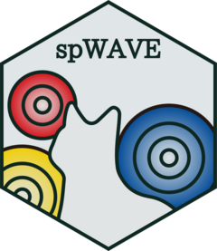
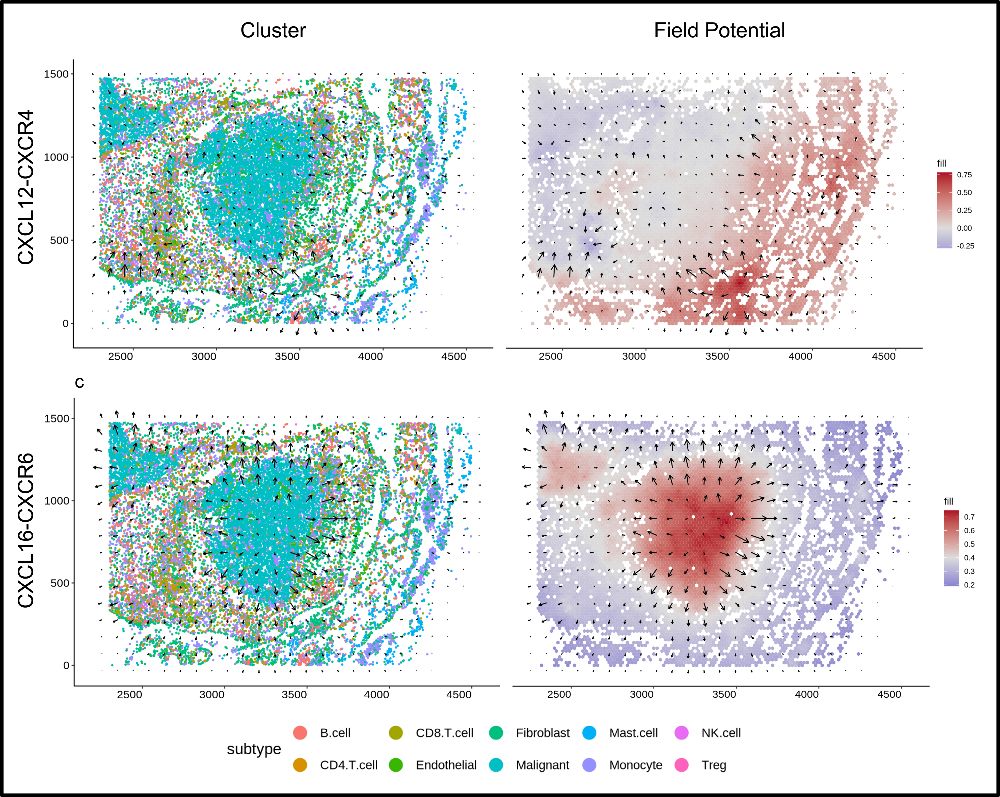

<!-- README.md is generated from README.Rmd. Please edit that file -->

```{r, include = FALSE}
knitr::opts_chunk$set(
  collapse = TRUE,
  comment = "#>",
  fig.path = "man/figures/README-",
  out.width = "100%"
)
```


# spWAVE 
<div align="left">
<a href="README.md">English</a> &nbsp;|&nbsp;
<a href="doc/README_CH.md">中文</a>
</div>

<!-- badges: start -->
[]()
[]()
[](https://www.gnu.org/licenses/gpl-3.0)
<!-- badges: end -->

**Sp**atial **W**hole **A**rea **V**ector **E**stimation (spWAVE) is design to 
estimate the ligands-receptors spatial interference based on conservative vector field model with superposition principle.

<div align="center">
</img>
</div>

## Installation

### Dependencices
We recomannd [Seurat](https://satijalab.org/seurat/) >= 5.0.
This package use the new Seurat 'layers' structure to access data, which is not compatible with Seurat < 5.0.
For lower version Seurat and other ST objects, we provided the function to constructe spWAVE object by 
mannully giving the coordinate info, expression matrix, and other information.

This package contains codes for Rcpp. 
Please ensure that the corresponding compilation environment is installed, 
such as Rtools for Windows and Xcode for macOS.

For downstream analysis, install [tradeSeq](https://github.com/statOmics/tradeSeq) 
to analyze the field quantities related differentially expressed genes.


### Install
Install from GitHub:
```{r,eval=FALSE}
devtools::install_github("liuhuoz/spWAVE")
#or install develop version
devtools::install_github("liuhuoz/spWAVE",ref="dev")
```

Or download the GitHub source zip file, and install it from local:
```{r,eval=FALSE}
devtools::install_local("spWAVE.zip")
```


## Quick Start
For small datasets(cells < 10000), 
constructing a spWAVE object from a Seurat and computing the vector field 
can follow the quick start code:
```{r quick start, eval=FALSE}
library(spWAVE)
seurat_obj <- readRDS("seurat_obj.rds")
human_db <- load_database(db_source = "CellChat",db_species = "human")
#Or load a database form CellPhoneDB of mouse
#mouse_db <- load_database(db_source = "CellPhoneDB",db_species = "mouse")

spWAVE_obj <- create_spWAVE_object(seurat_obj,human_db)
spWAVE_obj %<>% perform_LR_field_calc()
spWAVE_obj %<>% perform_S2S_score_calc()
spWAVE_obj %<>% perform_C2C_score_calc(shuffle_iter=200,verbose=T)

```

For large datasets(cells > 10000), we recommend utilizing the alternative 'holed manner' method, 
which reduces computational resource consumption.
```{r holed method, eval=FALSE}
spWAVE_obj <- create_spWAVE_object(seurat_obj,human_db)

spWAVE_obj %<>% generate_kmeans_coord()
spWAVE_obj %<>% generate_meta_expr()

spWAVE_obj %<>% perform_LR_field_hole_calc()
spWAVE_obj %<>% perform_S2S_score_calc()
spWAVE_obj %<>% perform_C2C_score_calc(shuffle_iter=200,verbose=T)

```

## Full Tutorial for Analysis and Visualization
Please check the full tutorial in tutorial folder.

Field Estimation for low-res ST dataset: 
[Analysis LR field of 10x Visium Mouse Brain dataset using spWAVE](tutorial/Field_Est2.html)

Field Estimation for Hi-res ST dataset and Advanced Trick: 
[Analysis LR field of large dataset using spWAVE](tutorial/Field_Est3.html)

Downstream Analysis: "spWAVE/tutorial/Downstream.html" (wait update)

## About Me / Career Interests
I'm a MD candidate in Oncology focusing on tumor micro-environment, tumor-immune interactions and tumorigenesis. 

I'm interested in developing computational methods for spatial transcriptomics data analysis.
The goal of my research is to understand how the CCC(cell-cell communication) influence the spatial organization and dynamics promoting tumor development.

I'm currently seeking postdoctoral or research assistant positions to contribute 
to innovative projects in academia or industry.

**Research Interests:** 

  - Computational Method Development for Spatial Transcriptomics

  - AI for Spatial Transcriptomics

  - Spatial Organization and Dynamics Driving Tumor Development

**Technical Skills:** 

  - Python, R, Linux, Slurm and Git experience

  - statistical modeling

  - multi-omic data analysis(scRNA-seq, spatial transcriptomics, genomics)

If you are interested in my work or have any questions, please feel free to contact me.

📫Email: [liuhuo2012@gmail.com](mailto:liuhuo2012@gmail.com)
